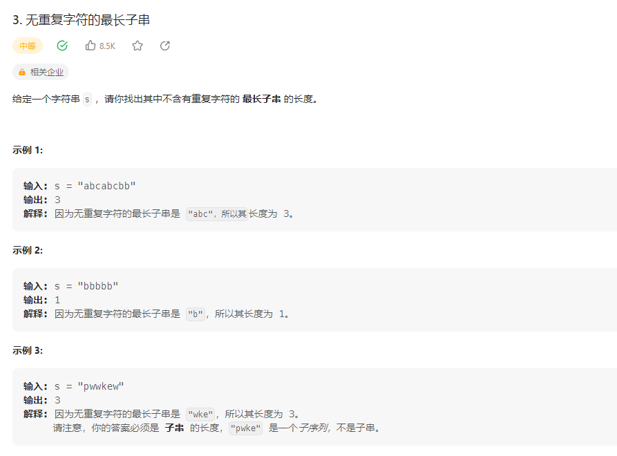

## 无重复字符的最长子串



### 解题思路

1.滑动窗口

设置一个滑动窗口，窗口内的字符不重复，窗口的大小就是最长子串的长度。
设置一个map数组，用于储存窗口内的字符以及出现的次数。
遍历字符串，如果字符在map中出现，说明窗口内有重复的字符，窗口的左边界向右移动，直到窗口内的字符不重复。
每次移动窗口，都要更新最长子串的长度。

```php
class Solution {

    /**
     * @param String $s
     * @return Integer
     */
    function lengthOfLongestSubstring($s) {
        $map = [];
        $max = 0;
        $left = 0;
        for ($i = 0; $i < strlen($s); $i++) {
            if (isset($map[$s[$i]])) {
                $left = max($left, $map[$s[$i]] + 1);
            }
            $map[$s[$i]] = $i;
            $max = max($max, $i - $left + 1);
        }
        return $max;
    }
}
```