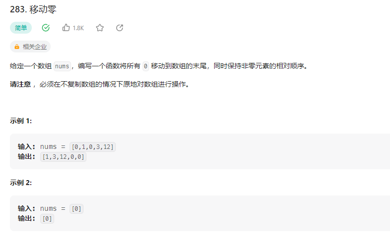

## 移动零



### 解题思路

定义一个空数组，遍历原数组，将非零元素添加到新数组中，最后将新数组补零。

```php
class Solution {

    /**
     * @param Integer[] $nums
     * @return NULL
     */
    function moveZeroes(&$nums) {
        $leng = count($nums);
        $result = [];
        for($i=0;$i<$leng;$i++){
            if($nums[$i] !== 0) $result[] = $nums[$i];
        }
        for($i=0;$i<$leng;$i++){
            if(isset($result[$i])){
                $nums[$i] = $result[$i];
            } else {
                $nums[$i] = 0;
            }
        }
    }
}
```
