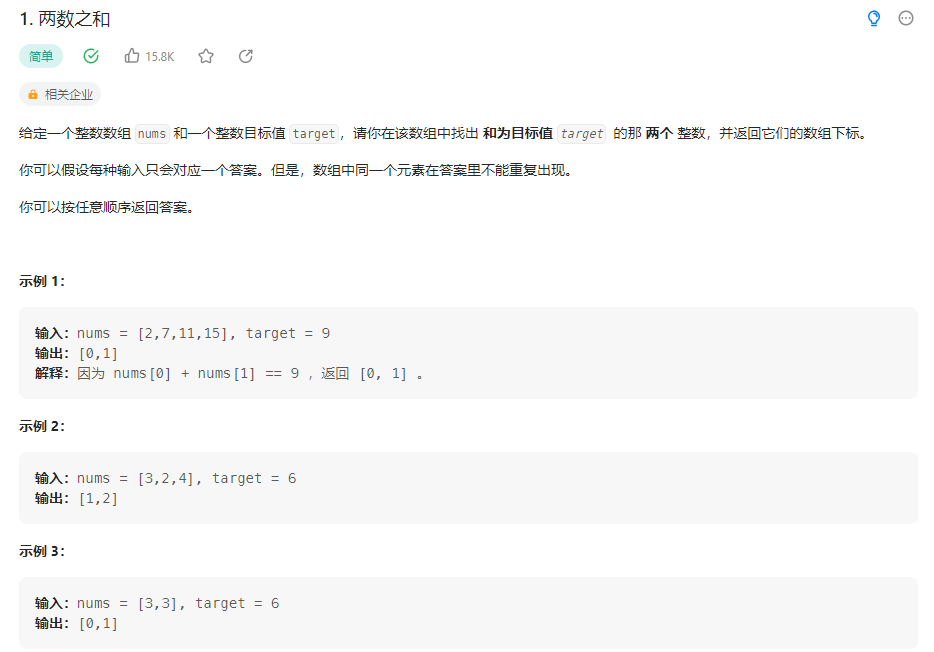

## 两数之和


### 解题思路
遍历数组，得出目标值减去遍历值的结果，使用PHP内置函数in_array()判断结果是否在数组中，如果在数组中，则使用PHP内置函数array_keys()获取结果在数组中的key，然后将遍历值的key和结果在数组中的key组成数组返回

```php
class Solution {

    /**
     * @param Integer[] $nums
     * @param Integer $target
     * @return Integer[]
     */
    function twoSum($nums, $target) {
        $length = count($nums);
        for($i=0;$i<$length;$i++){
            if(in_array($target-$nums[$i],$nums)){
                if(($j = array_keys($nums,$target-$nums[$i])[0]) === $i) continue;
                return [$i, $j];
            }
        }
    }
}
```
