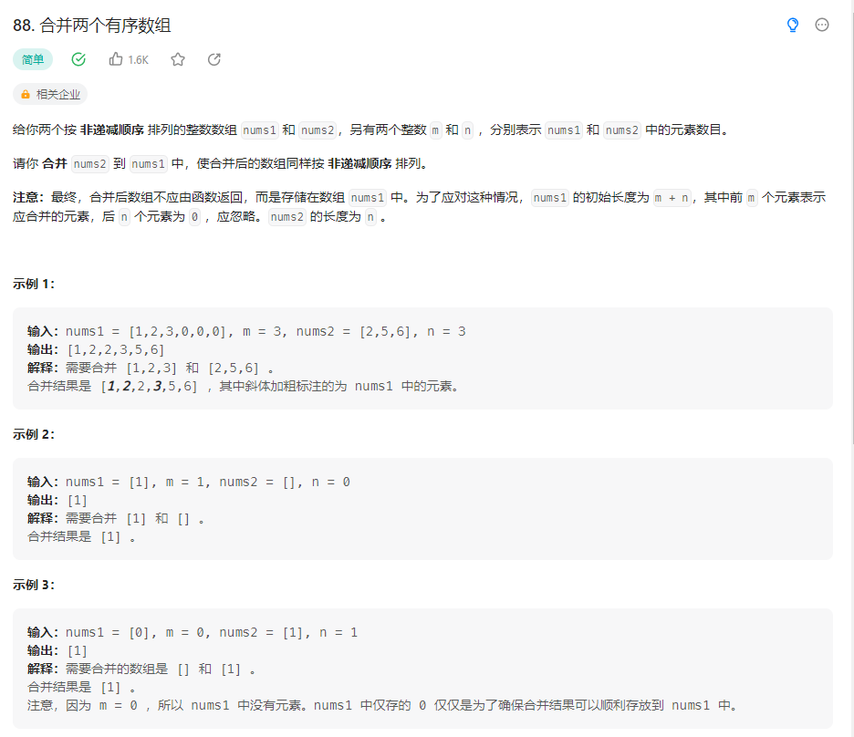

## 合并两个有序数组



### 解题思路

先将第一个数组的下标为 $m 之后的元素全部删除，然后将第二个数组的元素从第一个岛第 $n 个插入数组， $nums1 中，对数组 $nums1 进行冒泡排序

```php
class Solution {

    /**
     * @param Integer[] $nums1
     * @param Integer $m
     * @param Integer[] $nums2
     * @param Integer $n
     * @return NULL
     */
    function merge(&$nums1, $m, $nums2, $n) {
        if($m != 0){
            for($i = count($nums1)-1; $i > $m-1 ; $i-- ){
                unset($nums1[$i]);
            }
        } else {
            $nums1=[];
        }
        if($n !=0 ){
            for($i = 0; $i < count($nums2) ; $i++ ){
                $nums1[$m] = $nums2[$i];
                $m++;
            }
        } else {
            $nums2 = [];
        }
        for($i = 0; $i < count($nums1); $i++){
            for($j = $i; $j<count($nums1); $j++){
                if($nums1[$i] > $nums1[$j]){
                    $k = $nums1[$i];
                    $nums1[$i] = $nums1[$j];
                    $nums1[$j] = $k;
                }
            }
        }
    }
} 
```