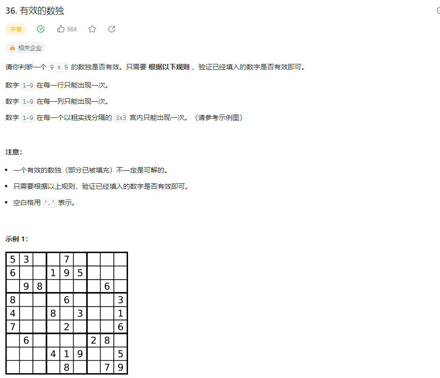

## 有效的数独


### 解题思路

设置3个数组，分别用来存储行、列、块的值，然后遍历数组，将值存入对应的数组中，如果数组中已经存在该值，则返回false，否则返回true

```php 
class Solution {

    /**
     * @param String[][] $board
     * @return Boolean
     */
    function isValidSudoku($board) {
        $row = $col = $block = [];
        for($i = 0; $i <count($board); $i++){
            for($j = 0; $j < count($board); $j++){
                $t = $board[$i][$j];
                if($t == '.') continue;

                $blockKey = floor($i/3)*3+floor($j/3);

                if(isset($row[$i][$t]) || isset($col[$t][$j]) || isset($block[$blockKey][$t])){
                    return false;
                }
                $row[$i][$t] = $t;
                $col[$t][$j] = $t;
                $block[$blockKey][$t] = $t;
            }
        }
        return true;
    }
}
```