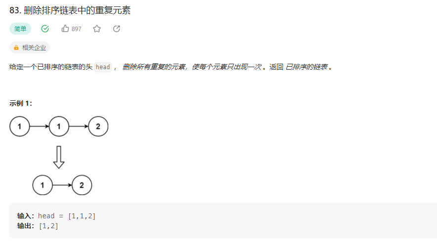

## 删除排序链表中的重复元素



### 解题思路
1.遍历

```php
class Solution {

    /**
     * @param ListNode $head
     * @return ListNode
     */
    function deleteDuplicates($head) {
        $cur = $head;
        while($cur != null && $cur->next != null){
            if($cur->val == $cur->next->val){
                $cur->next = $cur->next->next;
            }else{
                $cur = $cur->next;
            }
        }
        return $head;
    }
}
```

2.递归

```php
class Solution {

    /**
     * @param ListNode $head
     * @return ListNode
     */
    function deleteDuplicates($head) {
        if($head == null || $head->next == null){
            return $head;
        }
        $head->next = $this->deleteDuplicates($head->next);
        return $head->val == $head->next->val ? $head->next : $head;
    }
}
```