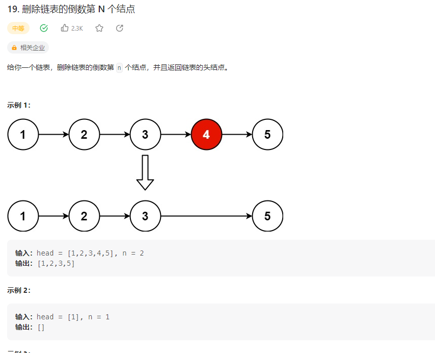

## 删除链表的倒数第N个结点



### 解题思路

1. 快慢指针
   快指针先走n步，然后快慢指针一起走，当快指针走到尾部时，慢指针指向的就是倒数第n个结点

```php
class Solution {

    /**
     * @param ListNode $head
     * @param Integer $n
     * @return ListNode
     */
    function removeNthFromEnd($head, $n) {
        $fast = $head;
        $slow = $head;
        for($i=0;$i<$n;$i++){
            $fast = $fast->next;
        }
        if($fast == null){
            return $head->next;
        }
        while($fast->next != null){
            $fast = $fast->next;
            $slow = $slow->next;
        }
        $slow->next = $slow->next->next;
        return $head;
    }
}
```

2. 递归
   递归到链表尾部时，返回一个计数器，每返回一次，计数器加一，当计数器等于n时，返回当前节点的下一个节点

```php
class Solution {

    /**
     * @param ListNode $head
     * @param Integer $n
     * @return ListNode
     */
    function removeNthFromEnd($head, $n) {
        $this->count = 0;
        $this->n = $n;
        $head->next = $this->remove($head->next);
        return $head;
    }

    function remove($head){
        if($head == null){
            return null;
        }
        $head->next = $this->remove($head->next);
        $this->count++;
        if($this->count == $this->n){
            return $head->next;
        }
        return $head;
    }
}
```