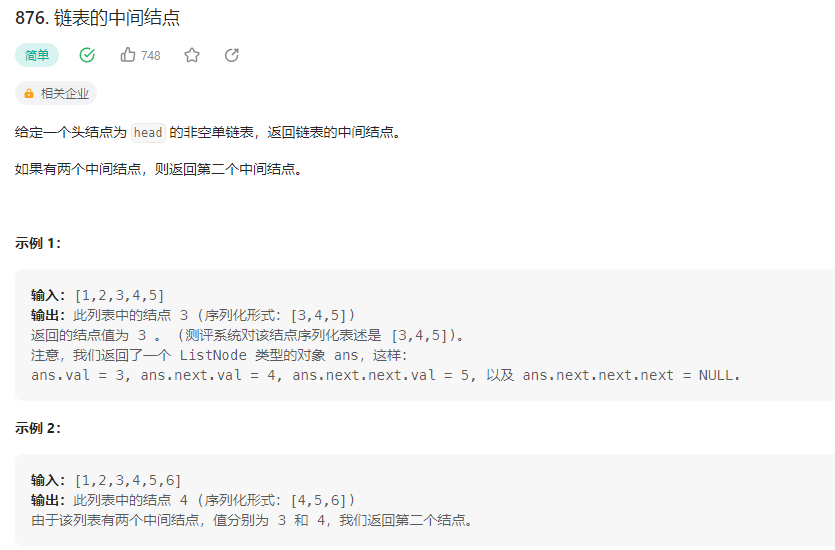

## 链表的中间结点



### 解题思路
1. 快慢指针
快指针每次走两步，慢指针每次走一步，当快指针走到链表尾部时，慢指针正好走到链表中间

```php
class Solution {

    /**
     * @param ListNode $head
     * @return ListNode
     */
    function middleNode($head) {
        $slow = $head;
        $fast = $head;
        while($fast != null && $fast->next != null){
            $slow = $slow->next;
            $fast = $fast->next->next;
        }
        return $slow;
    }
}
```

2. 数组
将链表中的元素放入数组中，然后返回数组中间的元素

```php
class Solution {

    /**
     * @param ListNode $head
     * @return ListNode
     */
    function middleNode($head) {
        $arr = [];
        while($head != null){
            $arr[] = $head;
            $head = $head->next;
        }
        return $arr[floor(count($arr)/2)];
    }
}
```

3.递归
递归到链表尾部时，返回一个计数器，每返回一次，计数器加一，当计数器等于链表长度的一半时，返回当前节点

```php
class Solution {

    /**
     * @param ListNode $head
     * @return ListNode
     */
    function middleNode($head) {
        $this->count = 0;
        return $this->helper($head);
    }

    function helper($head){
        if($head == null) return null;
        $this->count++;
        $node = $this->helper($head->next);
        if($this->count == floor($this->count/2)) return $head;
        return $node;
    }
}
```