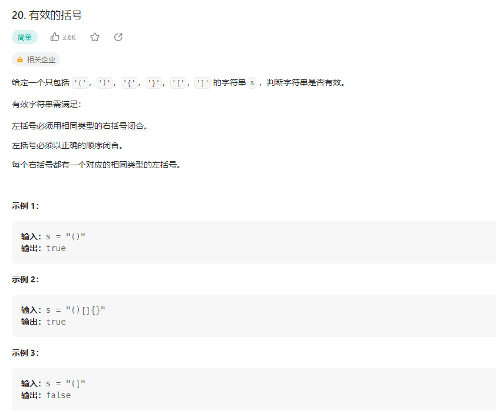

## 有效的括号



### 解题思路

栈结合哈希查找表

```php
class Solution {

    /**
     * @param String $s
     * @return Boolean
     */
    function isValid($s) {
        $stack = new SplStack();
        $map = [
            ')' => '(',
            ']' => '[',
            '}' => '{'
        ];
        for($i = 0; $i < strlen($s); $i++){
            if(isset($map[$s[$i]])){
                if($stack->isEmpty() || $stack->pop() != $map[$s[$i]]){
                    return false;
                }
            }else{
                $stack->push($s[$i]);
            }
        }
        return $stack->isEmpty();
    }
}

// 同理
class Solution {

    /**
     * @param String $s
     * @return Boolean
     */
    function isValid($s) {
        $map=['('=>')','{'=>'}','['=>']'];//哈希查找表
        $stack=new SplStack();//存储左括号的栈

        $len=strlen($s);//字符串长度
        for($i=0;$i<$len;$i++){
            if(isset($map[$s[$i]])){//左括号入栈
                $stack->push($s[$i]);
            }else{//右括号，2种情况判断
                if($stack->isEmpty()||$map[$stack->pop()]!=$s[$i]){
                    return false;
                }                
            }
        }
        return $stack->isEmpty();//返回时，判断栈是否为空

    }
}
```

### 解法2：栈

遍历字符串，如果是左括号，则将其入栈，如果是右括号，则将栈顶元素出栈，如果出栈的元素不是对应的左括号，则返回false，否则继续遍历，最后判断栈是否为空，如果为空，则返回true，否则返回false

```php
class Solution {

    /**
     * @param String $s
     * @return Boolean
     */
    function isValid($s) {
        $stack = new SplStack();
        for($i = 0; $i < strlen($s); $i++){
            if($s[$i] == '('){
                $stack->push(')');
            }elseif($s[$i] == '['){
                $stack->push(']');
            }elseif($s[$i] == '{'){
                $stack->push('}');
            }else{
                if($stack->isEmpty() || $stack->pop() != $s[$i]){
                    return false;
                }
            }
        }
        return $stack->isEmpty();
    }
}
```