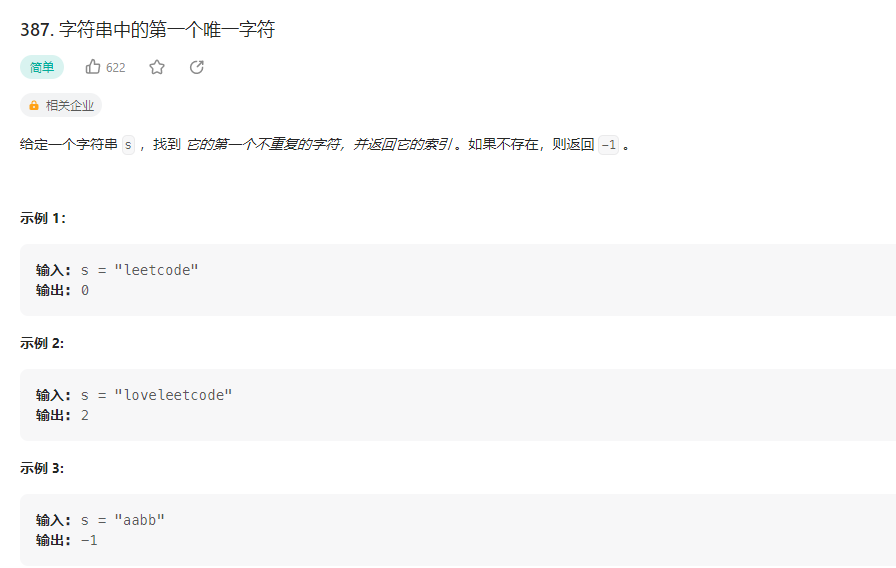

## 字符串中的第一个唯一字符



### 解题思路

先进行第一次遍历，在数组中记录每个字母的最后一次出现的所在索引。然后再通过一次循环，比较各个字母第一次出现的索引是否为最后一次的索引。如果是，我们就找到了我们的目标，如果不是我们将其设为
-1（标示该元素非目标元素）如果第二次遍历最终没有找到目标，直接返回 -1即可。

* 比较各个字母第一次出现的索引是否为最后一次的索引
* 如果不是我们将其设为 -1（标示该元素非目标元素）

```php 
class Solution {

    /**
     * @param String $s
     * @return Integer
     */
    function firstUniqChar($s) {
        if(!$s) return -1;
        $arr = str_split($s);
        $a1 = [];
        foreach($arr as $k=>$v){
            $a1[$v] = $k;
        }

        foreach($arr as $k  => $v){
            if($a1[$v] == $k) return $k;
            $a1[$v] = -1;
        }
        return -1;
    }
}
```