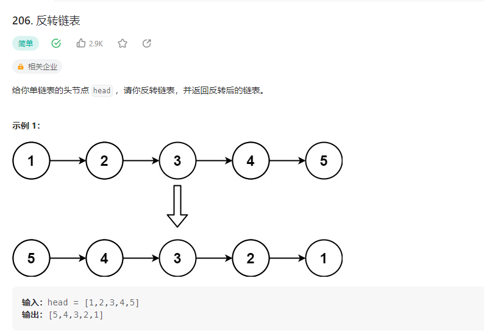

## 反转链表



### 解题思路

1.遍历
设置一个空节点，遍历链表，将当前节点的next指向空节点，然后将空节点指向当前节点，最后将当前节点指向下一个节点。

```php
class Solution {

    /**
     * @param ListNode $head
     * @return ListNode
     */
    function reverseList($head) {
        $prev = null;
        $cur = $head;
        while($cur != null){
            $next = $cur->next;
            $cur->next = $prev;
            $prev = $cur;
            $cur = $next;
        }
        return $prev;
    }
}
```

2.递归

```php
class Solution {

    /**
     * @param ListNode $head
     * @return ListNode
     */
    function reverseList($head) {
        if($head == null || $head->next == null){
            return $head;
        }
        $newHead = $this->reverseList($head->next);
        $head->next->next = $head;
        $head->next = null;
        return $newHead;
    }
}
```
