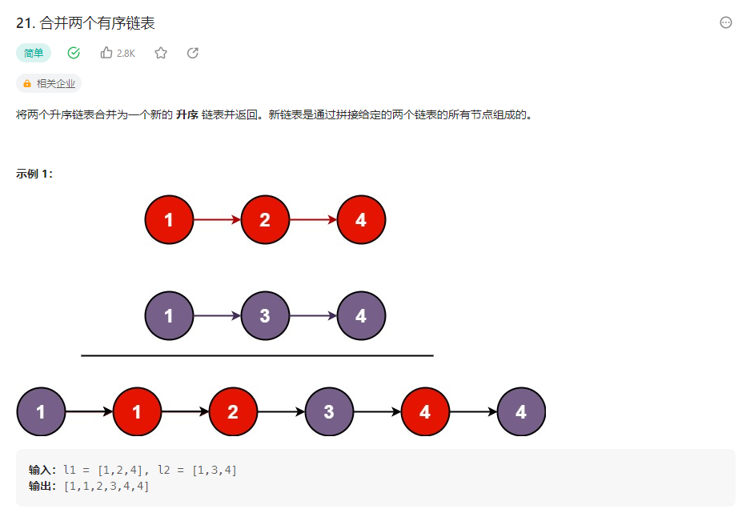

## 合并两个有序链表


### 解题思路
1、递归
 返回当前两个链表合并之后的头节点(每一层都返回排序好的链表头)
```php
class Solution {

    /**
     * @param ListNode $l1
     * @param ListNode $l2
     * @return ListNode
     */
    function mergeTwoLists($l1, $l2) {
        if($l1 == null) return $l2;
        if($l2 == null) return $l1;
        // 递归
        // 如果l1的值小于l2的值，那么l1的下一个节点就是l1和l2的下一个节点的合并
        if($l1->val < $l2->val){
            $l1->next = $this->mergeTwoLists($l1->next,$l2);
            return $l1;
        }else{
            $l2->next = $this->mergeTwoLists($l1,$l2->next);
            return $l2;
        }
    }
}
```
2、迭代
```php
class Solution {

    /**
     * @param ListNode $list1
     * @param ListNode $list2
     * @return ListNode
     */
    function mergeTwoLists($list1, $list2) {
        if(empty($list1) && empty($list2)){
            return [];
        }
        $result = new ListNode(null);
        $res = $result;
        // 两个链表都不为空
        while($list1 !== null && $list2 !== null){
            // 比较两个链表的值，小的放在新链表中
            if($list1->val <= $list2->val){
                $res->next = $list1;
                $list1 = $list1->next;
            } else {
                $res->next = $list2;
                $list2 = $list2->next;
            }
            // 新链表指针后移
            $res = $res->next;
        }
        // 如果其中一个链表为空，直接把另一个链表的值放在新链表中
        if ($list1 !== null) {
            $res->next = $list1;
        } elseif ($list2 !== null) {
            $res->next = $list2;
        }
        // 返回新链表，注意要去掉头节点
        return $result->next;
    }
}
```