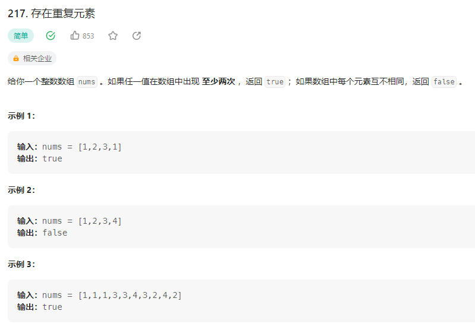

## 存在重复元素

### 解法1：暴力法(不讲武德)
使用PHP内置函数，对数组进行去重，然后比较去重后的数组长度和原数组长度是否相等
```php 
class Solution {

    /**
     * @param Integer[] $nums
     * @return Boolean
     */
    function containsDuplicate($nums) {
        if(count(array_unique($nums)) !== count($nums)){
            return true;
        }
        return false;
    }
}
```
### 解法2：哈希表
遍历数组，将数组元素作为key，布尔值true作为value，存入哈希表中，如果哈希表中已经存在该元素，则返回true
```php
class Solution {

    /**
     * @param Integer[] $nums
     * @return Boolean
     */
    function containsDuplicate($nums) {
        $map = [];
        for($i = 0; $i < count($nums); $i++){
            if($map[$nums[$i]]){
                return true;
            }
            $map[$nums[$i]] = true;
        }
        return false;
    }
}
```