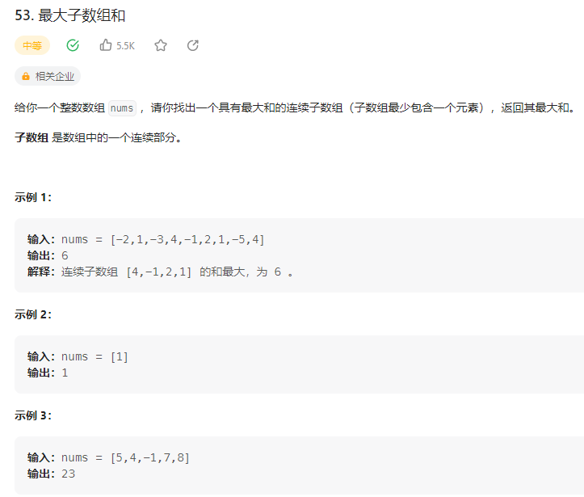

## 最大子数组和

### 解题思路
将数组首位元素作为最大值，然后遍历数组。创建中间值，将数组遍历的值的和赋值给中间值，如果中间值大于最大值，则将中间值赋值给最大值，如果中间值小于最大值，则继续遍历数组，直到遍历完数组，返回最大值。
```php
class Solution {

    /**
     * @param Integer[] $nums
     * @return Integer
     */
    function maxSubArray($nums) {
        $max = $nums[0];
        $a = 0;
        for($i = 0; $i<count($nums); $i++){
            $a += $nums[$i];
            if($a < $nums[$i]) $a = $nums[$i];
            $max = $a > $max? $a : $max;
        }
        return $max;
    }
}
```