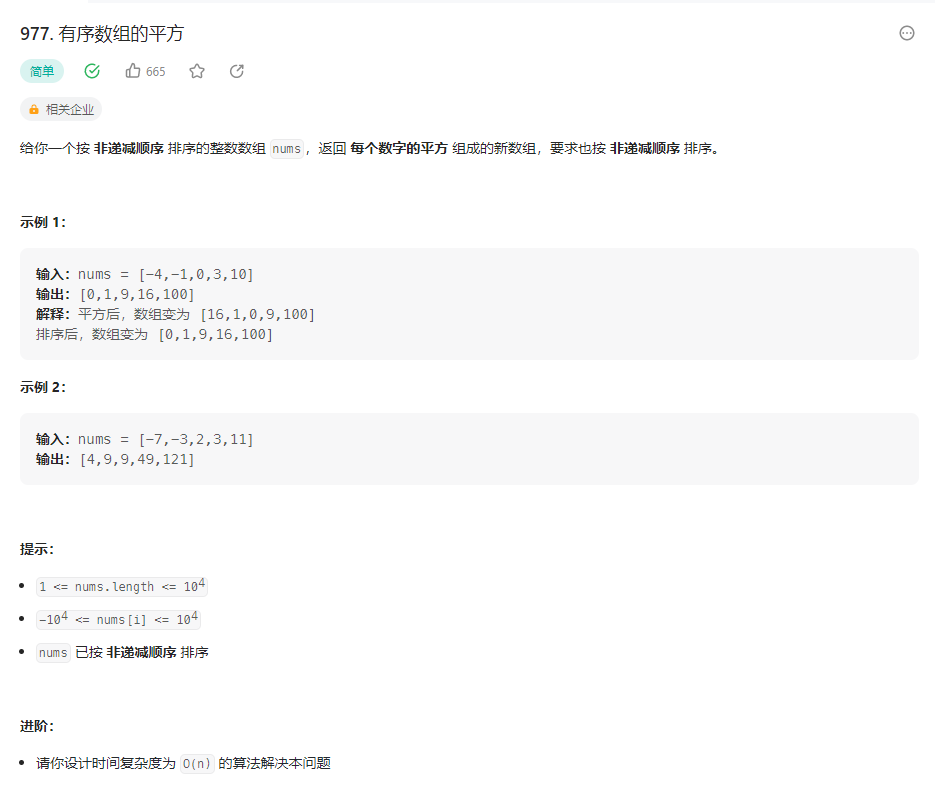

## 有序数组的平方


### 解题思路

重点：这个数组是有序的。也就是说最大值在数组的两端，不是左边就是右边。
双指针法：

1、设置两个指针，一个指向数组的第一个元素，一个指向数组的最后一个元素。

如果A[i] * A[i] < A[j] * A[j] 那么result[k--] = A[j] * A[j]; 

如果A[i] * A[i] >= A[j] * A[j] 那么result[k--] = A[i] * A[i]; 。

```php 
class Solution {

    /**
     * @param Integer[] $nums
     * @return Integer[]
     */
    function sortedSquares($nums) {
        $res = [];
        for ($i = 0; $i < count($nums); $i++) {
            $res[$i] = 0;
        }
        $k = count($nums) - 1;
        for ($i = 0, $j = count($nums) - 1; $i <= $j; ) {
            if ($nums[$i] ** 2 < $nums[$j] ** 2) {
                $res[$k--] = $nums[$j] ** 2;
                $j--;
            }
            else {
                $res[$k--] = $nums[$i] ** 2;
                $i++;
            }
        } 
        return $res;
    }
}
```