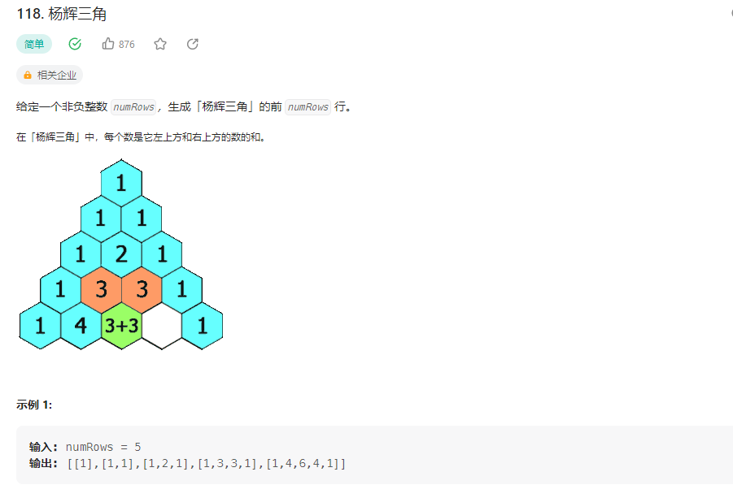

## 杨辉三角



### 解题思路

动态规划
算法： 0、状态: dp[0]=[1];
dp[0] = [1];
dp[0]=[1];
dp[1] = [1,1];
1、状态转移方程：
dp[dp[dp[i][] = dp[dp[dp[i-1][j−1]+j-1]+j−1]+dp[i−1][i-1][i−1][j];

```php 
class Solution {

    /**
     * @param Integer $numRows
     * @return Integer[][]
     */
    function generate($numRows) {
        if($numRows == 0){
            return [];
        }
        if($numRows == 1){
            return [[1]];
        }
        $result[0] = [1];
        $result[1] = [1,1];
        for($i = 2; $i < $numRows ; $i++){
            $result[$i][] = 1; 
            for($j=1 ;$j < $i ;$j++){
                $result[$i][] = $result[$i-1][$j-1] + $result[$i-1][$j];
            }
            $result[$i][] = 1;
        }
        return $result;
    }
}
```