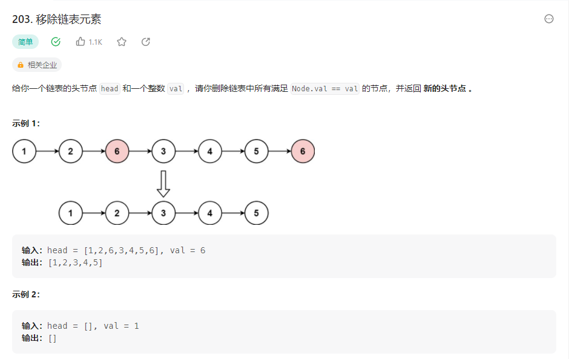

## 移除链表元素


### 解题思路
设置一个虚拟头节点，指向头节点，设置一个指针指向虚拟头节点，遍历链表，如果当前节点的值等于要删除的值，则将指针指向当前节点的下一个节点，否则指针指向当前节点，最后返回虚拟头节点的下一个节点。

```php
class Solution {

    /**
     * @param ListNode $head
     * @param Integer $val
     * @return ListNode
     */
    function removeElements($head, $val) {
        $dummy = new ListNode(0);
        $dummy->next = $head;
        $cur = $dummy;
        while($cur->next != null){
            if($cur->next->val == $val){
                $cur->next = $cur->next->next;
            }else{
                $cur = $cur->next;
            }
        }
        return $dummy->next;
    }
}
```