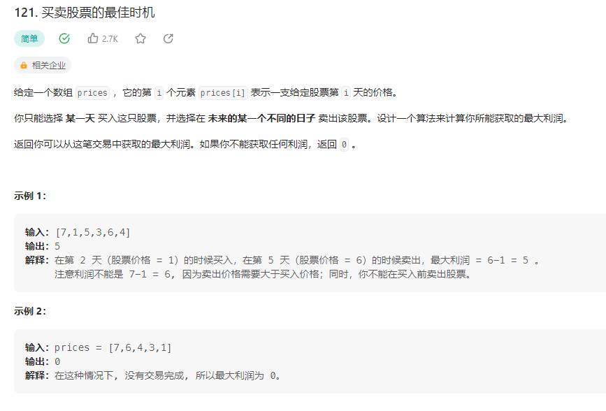

## 买卖股票的最佳时机



### 解题思路
设置最小值min为$prices[0]，最大值max为0收益。
循环遍历数组，将遍历值与min比较，取出最小值赋值给min。使用遍历值减去min判断是否大于当前最大值max
如果大于，则将结果值替换当前的max。
```php 
class Solution {

    /**
     * @param Integer[] $prices
     * @return Integer
     */
    function maxProfit($prices) {
        $min = $prices[0];
        $max = 0;
        foreach($prices as $value){
            $min = $min > $value ? $value : $min;
            $max = $max > ($value - $min) ? $max : $value - $min;
        }
        return $max;
    }
}
```